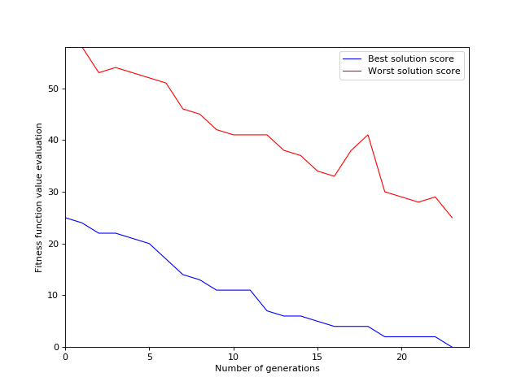
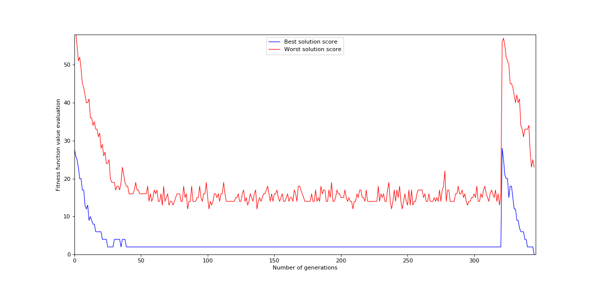

# Sudoku solver
## A lot of approaches are available
With a 9x9 size, you should be able to solve the sudoku with another
approach than deploying a genetic algorithm:
* brute force (well, only for small and easy grids)
* [pencil mark](https://www.learn-sudoku.com/pencil-marks.html)
* [backtracking](https://www.geeksforgeeks.org/sudoku-backtracking-7/)  

And I am pretty sure that a lof of others exists if you have time for a little googling session.

With greater size, it is not so easy and even for some 9x9 grids, sometimes
it is difficult to solve them *'just with logic'* and you need to bet on some answers
to move on.  
Extract from a good reading [here](http://micsymposium.org/mics_2009_proceedings/mics2009_submission_66.pdf):
*"The standard approach to computer-based Sudoku solvers is a generate-and-test solution using
backtracking. This strategy works extremely well for smaller grid sizes (including the
standard 9x9 grid configuration), but becomes computationally intractable for larger sizes. In
fact, the general problem of solving NxN Sudoku puzzles is known to be NP-complete"*

## So, why genetics ?
A genetic algorithm might find the solution quicker than trying all possible
solutions (after all, it is one of their goal) but it does not mean than it ***will***
find the solution.    
Compared to other approaches, genetic algorithm seems not being a good choice.
It obviously depends on all parameters you will set (population size, number of
generations, mutation rate, etc) and play with. With a large enough population size or number of generations,
it will/should most of the time solve the sudokus. But it happens sometimes, depending
on the difficulty level that the program gets stuck in local minima.
Then, there is no other choice than restarting it.  

As said earlier, solving NxN sudoku puzzle is a NP-complete in terms of complexity, that is why GA is a
good candidate, but not the best one (again, a little googling session and you will find a lot of documentations
regarding this topic).

## My approach
Nothing really new or disrupting, it is highly similar to everything you can find on the internet related to
sudoku solving and genetic algorithms.

### Setting puzzles to solve  
Puzzles to solve are provided in a folder named ***"samples"***. Problems are stored
in plain text files containing the values where:
* ***'|'*** character is the grid vertical separator
* ***'-'*** is the horizontal one.
* ***'0'*** digit character is used to represent an unknown value (so others are known and are so called 'fixed' values). 

### Parameters
Here are the few parameters that we can set:
* ***population_size***: (int) the whole population size to generate for each generation. Do not run with a too low value.
* ***selection_rate***: (float) elitism parameter: rate of the best elements to keep from one generation to be part of
the next breeders
* ***random_selection_rate***: (float) part of the population which is randomly selected to be part of the next breeders
* ***nb_children***: (int) how many children do we generate from 2 individuals
* ***max_nb_generations***: (int) maximum number of generations to generate. If a solution is found before, it is 
displayed, otherwise the best solution (but not THE solution) is displayed
* ***mutation_rate***: (float) part of the population that will go through mutation (avoid eugenics). You will probably 
need fine tuning for this one: too high value will not help to converge but too low will not allow diversity and you
might get stuck with local minima.
* ***model_to_solve***: (string) name of the .txt file which should be under 'samples' directory and contains the sudoku
problem to solve
* ***restart_after_n_generations_without_improvement***: (int) set it to a value greater than 0 to use it. Then, the
program will automatically restart if there is no improvement on _fitness value for best element after this number of
generations

A new parameter is planned to be used but not yet developed:
* ***presolving***: (boolean) if True, we can help by pre-solving the puzzle with easy values to find using a pencil
mark approach. With easy grids, after the pencil mark, everything will be solved and GA does not have to run.

### Operations
* ***create first population***: randomly generate some 'solutions' to evaluate. The approach is to generate a potential
solution with no duplicates in grids. But of course, there can be (and for sure there are) duplicates in rows and columns.
* ***ranking with _fitness function***: the _fitness function counts how many duplicates there are in the potential
solution: how many among rows and among columns (there are no duplicates in grids because we have generated them without
duplicates, and we pay attention to keep this always true)
* ***child generation***: 2 potential solutions are chosen randomly and generate n children (n is a parameter to set,
see above). A *'crossover point'* is randomly chosen: we will copy in the child grids from father when they are before 
the crossover point and from mother after the point.
* ***mutation***: a certain percentage of the population will mutate (set the value as a parameter, see above). In our
case, it only means that we will randomly pick one grid and then within this grid we will randomly swap 2 values (pay
attention to the fact that we cannot swap a 'fixed value', i.e a value that is known and provided). With such a
mutation approach we can guarantee that grid remains coherent and without duplicates but _fitness evaluation of a
'mutated' child is different than the one from the same element before its mutation. It can have improved it or not. 

### Possible improvements
* When generating children, keep parents if their _fitness is better

### Results
* **Parameters**  
    * population_size = 10000  
    * selection_rate = 0.25  
    * random_selection_rate = 0.25  
    * nb_children = 4  
    * mutation_rate = 0.25  
    * max_nb_generations = 500  
    * restart_after_n_generations_without_improvement = 300  

* **Sample 3x3-easy02** (nb values to find = 49)  
Without using the pencil mark (***presolving = False***, otherwise everything will be found within less than 1 second), this
GA was most of the time able to solve the puzzle with few generations (more or less 20).
See the picture below which shows the evolution of best and worst score among generations, the best one is almost always
improving and fastly (too ?) converges toward the solution.  
  

Problem solved after 23 generations (it took 0:03:17.72 to solve it (whereas 0:00:00.04 to solve it with pencil mark)

Changing the population size has a big impact (yeah, of course....) ! I took 5000 as a population size and this is what
I got:  
  

The problem was not yet solved after 319 generations and, as you can see on the graph, without improvement (stuck in local
minima) so it restarted as per the configuration. Then it has been able to solve it after 24 generations. Note that here
it is total luck as the restart does not keep the best elements from the previous runs (could be one of the improvements).
It took 0:24:05.68 to solve it.

* **Sample 3x3-easy03** (nb values to find = 43)  
With same parameters as above, the problem has been solved after 15 generations. It took 0:01:57.23 to solve it.  
I changed both *selection_rate* and *mutation_rate* and put both to 0.2 (instead of 0.25) and accordingly adapted the
*nb_children* to 5.
Few impact, the problem has also been solved after 17 generations and it took 0:02:20.55 to solve it.